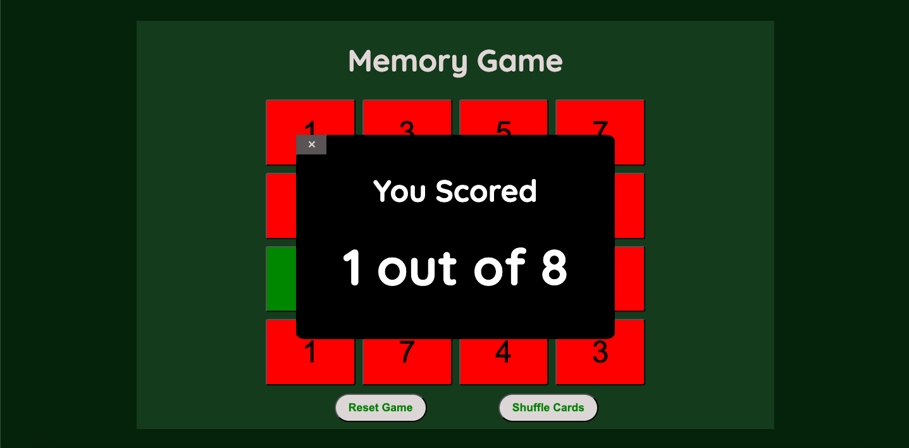

# Memory Game

### I wanted to try and make a game that would be fun to play and to improve my memory, so I made this memory game.

### The game has 16 tiles with 8 pairs of numbers and the goal is to match the two identical numbers. I implemented many features to make this game work. Firstly of course I made it so that when a tile was clicked it would turn over to reveal a button. Next, I added a reset button to make all the tiles hidden again. After that, I made it so when a pair of number is incorrect it would show red, and if correct it would show green. Also, I added a modal at the end of a game to show the total correct with a "close" button to return to the main screen. Finally, I added a shuffle button that would hide all the tiles and shuffle all of the tiles again.

